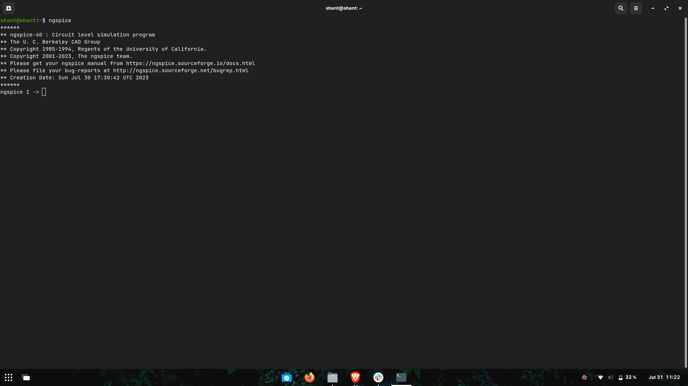

# DAY 0

ASIC Theory

# Steps for installation of the necessary tools

<details>
<summary>Yosys</summary>

Yosys is installed using the following set of steps.

```bash
$ git clone https://github.com/YosysHQ/yosys.git
$ cd yosys-master 
$ sudo apt install make (If make is not installed please install it) 
$ sudo apt-get install build-essential clang bison flex \
    libreadline-dev gawk tcl-dev libffi-dev git \
    graphviz xdot pkg-config python3 libboost-system-dev \
    libboost-python-dev libboost-filesystem-dev zlib1g-dev
$ make config-gcc
$ make 
$ sudo make install
```


</details>

<details>
<summary>Icarus verilog</summary>

Icarus Verilog also known as iverilog is installed using the following command.

```bash
$ sudo apt-get install iverilog

```


</details>

<details>
<summary>GTKWave</summary>

GTKWave is installed using the following commands.

```bash
$ sudo apt update
$ sudo apt install gtkwave
```


</details>

<details>
<summary>NGSpice</summary>
NGSpice is installed using the following commands.

After downloading the tarball from https://sourceforge.net/projects/ngspice/files/ to a local directory, unpack it using:

```bash
$ tar -zxvf ngspice-37.tar.gz
$ cd ngspice-37
$ mkdir release
$ cd release
$ ../configure  --with-x --with-readline=yes --disable-debug
$ make
$ sudo make install
```


    
</details>

<details>
<summary>Magic</summary>
Magic is installed using the following commands.

```bash
$   sudo apt-get install m4
$   sudo apt-get install tcsh
$   sudo apt-get install csh
$   sudo apt-get install libx11-dev
$   sudo apt-get install tcl-dev tk-dev
$   sudo apt-get install libcairo2-dev
$   sudo apt-get install mesa-common-dev libglu1-mesa-dev
$   sudo apt-get install libncurses-dev
$   git clone https://github.com/RTimothyEdwards/magic
$   cd magic
$   ./configure
$   make
$   sudo make install

```

![magic(./Images/magic.png)
    
</details>
