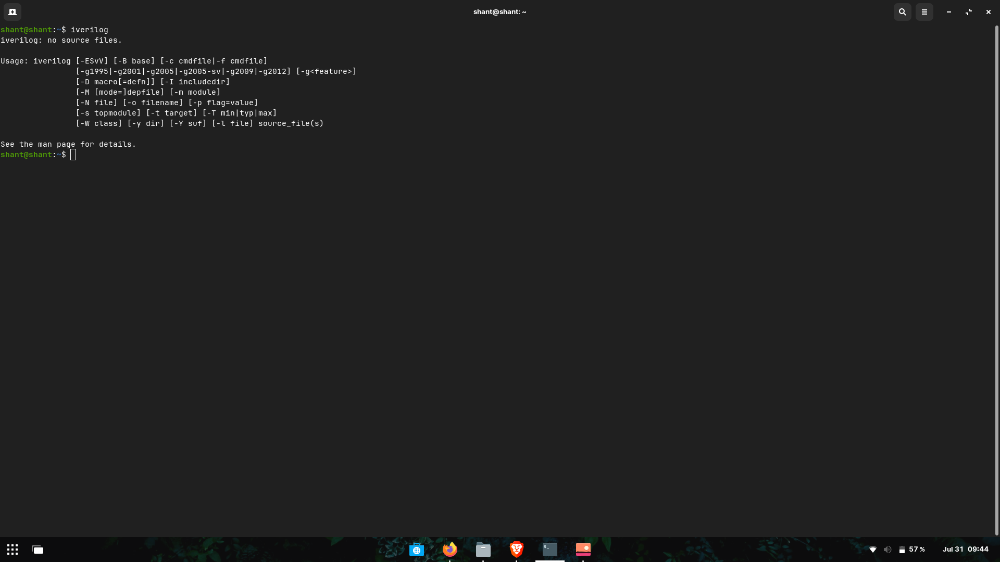

# DAY 0

ASIC Theory

Here are some images related to the project. Click on the dropdowns to view the images and their descriptions.

Yosys

Description of image 1 goes here.

Iverilog

Description of image 2 goes here.

GTKWave

Description of image 3 goes here.

