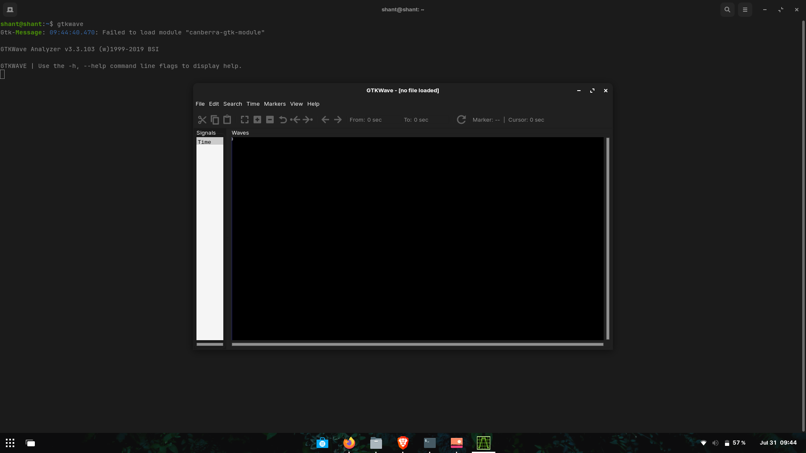

# DAY 0

ASIC Theory

Steps for installation

Yosys

![Yosys] (./Images/yosys.png)    

    
Iverilog

    <bloclquote>
        # Your Iverilog installation commands go here
        sudo apt-get install iverilog
    </blockquote>

    

    
GTKWave

    <blockquote>
        sudo apt update
        sudo apt install gtkwave
    </blockquote>

    

